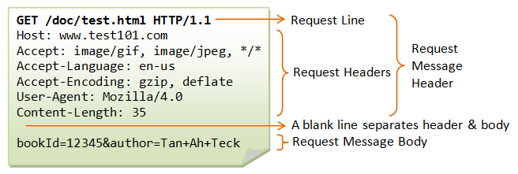

# Backend Development
---
# What we need to know?
- Select Programming Language (JavaScript, Python, Java, Scala, Go, Rust etc.)
    - Each language has different programming paradigm (OOP, functional)
    - Some language has different syntax (Python, Go, Rust)
    - We choose Java ✅
- Select Backend Framework
    - Javascript: Express, NestJS
    - Python: Django, Flask
    - Java: Spring ✅
    - Scala: Play
    - Go: Gin, Echo
    - Rust: Rocket
---

# Not only to work on backend, we need to connect Database too.
- SQL: MySQL, PostgreSQL, SQLite
- NoSQL: MongoDB, Redis, Cassandra

---

# How HTTP Request look like


---

# HTTP Verb
- GET: Get data from server
- POST: Create new data
- PUT: Update data
- DELETE: Delete data
- PATCH: Update specific data

---

# HTTP Status Code
- 1xx: Informational
- 2xx: Success
- 3xx: Redirection
- 4xx: Client Error
- 5xx: Server Error

---

# How we pass data with Request?
- Query String: `http://localhost:8080/users?name=foo&age=20` (Some call it Request Query)
- Path Variable: `http://localhost:8080/users/foo/20` (Some call it Request Parameter)
- Request Body: `{"name": "foo", "age": 20}`

---

# Authorization
- Bearer Auth (JWT)
- Cookie

---
# JSON is the most popular response body format
```json
{
  "name": "foo",
  "age": 20
}
```
